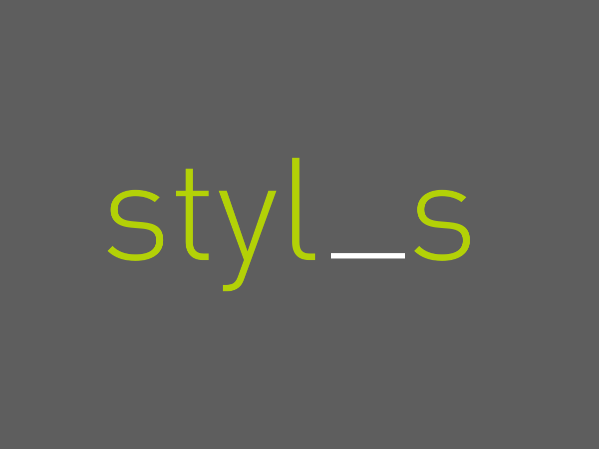

# Styl_s

**A WordPress Starter Theme Using Underscores & Stylus**

### What is this?

Styl_s is an adaptation of the bare bones starter theme, [Underscores (_s)](http://underscores.me). Currently the only difference you will find between this and the original is the use of [Stylus](https://learnboost.github.io/stylus/) rather than Sass, and it comes with a very basic gulp file for essential task running.

## Getting Started

**Actually there's very little to it!**

* ### Installing the theme

 * Just download or clone from here and rename the directory from `styl_s` to something like `mytheme` 👈 I know, super original.
 * If you want to go super customized, you will also need to do a find & replace on all instances of `'styl_s'` in the template files as [explained here](https://github.com/Automattic/_s#user-content-getting-started). Note, this is totally optional.
 * I'm pretty sure you're [discouraged from using this as a child theme](https://github.com/Automattic/_s#_s), so just get right to it and start editing the files directly.

* ### Task Running

 If you are used to using GUI pre-processors (codekit, prepos etc), just install the theme and off you go.

 If you prefer to run Gulp, this package comes with a very basic `gulpfile.js` which will:

 * Compile the main `style.styl` to `style.css`  _(all partials are imported into the single `style.styl` so there is only one file to compile)_
 * Autoprefix your CSS where needed
 * Synchronise file changes across multiple devices [automagically](http://www.browsersync.io/)
 * Optionally create a minified version of your CSS (a few of indicated lines to uncomment in `gulpfile.js`) 

## Plans and TODO's

Would love to eventually:

* Find a Stylus version of [Bourbon Neat](http://neat.bourbon.io/) to use as the grid system (would be nice wouldn't it?)

* Beef up the tooling a bit:
  - file minification & concatination
  - get sourcemaps working (right now every time I try it, it breaks things)
  - maybe even some image optimization tasks?

## Why am I making YAWPT * ?

- I really like writing Stylus over Sass and few minimal starter themes come with Stylus baked in.
- I'm learning gulp and this is a good way for me to try out new things.
- Putting this all up on github forces me to use best practice and version control to update my stuff, rather than letting it all rot in multiple versioned folders in my hardrive.
- It exposes my crappy code out there for the world to see. Take _that_ imposter syndrome!

___* yet another WordPress theme___

--------------------

#### I'm a lover not a fighter.

Keep in mind I'm just learning! I would love to get constructive feedback on anything you see here. Preferably by way of pull requests. You know, so that I can fumble through _that_ whole process too.